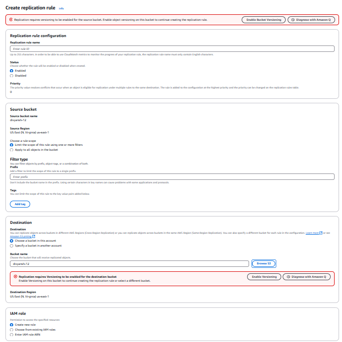

# AWS Training Program - Day 3

## **Amazon S3 - Simple Storage Service**
Amazon S3 is a highly scalable, durable, and secure object storage service used for storing and retrieving any amount of data from anywhere. It is designed for **high availability (99.99%)** and **11 nines durability (99.999999999%)**.


### **Key Features of Amazon S3**
1. **Unlimited Storage** - No limit on total storage, but individual objects can be up to **5TB**.
2. **Durability & Availability**
   - 11 nines durability (99.999999999%) ensures high data reliability.
   - Data is redundantly stored across multiple devices and facilities.
3. **Scalability**
   - Automatically scales to handle any amount of data, from small files to large datasets.
4. **Security**
   - IAM user policies, Bucket-level policies, encryption for data protection.
   - Supports encryption at rest (SSE-S3, SSE-KMS) and in-transit (SSL/TLS).
   - **Versioning** - Allows keeping multiple versions of an object to recover from accidental deletion or corruption.

   *Exercise in class:*
    created a folder and uploaded a txt file then we modified that file and uploaded it  
    Again (with same name) then the file with  latest updates was there and older version was not there

   Bucket created
   Versioning Enlabled
   
   File Deleted, File is marked as deleted but we can restore it
5. **Data Consistency**
   - Read-after-write consistency for new objects.
   - Eventual consistency for overwrite PUTs and DELETEs.
6. **Storage Classes** - Different tiers for cost optimization based on access patterns.
7. **Lifecycle Policies** - Automatically transition objects to cheaper storage classes or delete them after a defined period.
8. **Event Notifications** - Can trigger AWS Lambda, SNS, or SQS when certain events occur (e.g., object creation or deletion).
9. **Access Control**
   - Managed using **IAM policies, Bucket Policies, ACLs, and S3 Access Points**.
   - Fine-grained permission settings to control object access.

---
### **Amazon S3 Storage Classes**
| Storage Class | Description |
|--------------|------------|
| **S3 Standard** | High-performance, low-latency storage for frequently accessed data. |
| **S3 Intelligent-Tiering** | Automatically moves data between access tiers to optimize costs. |
| **S3 Standard-IA (Infrequent Access)** | Lower-cost storage for less frequently accessed data with retrieval fees. |
| **S3 One Zone-IA** | Cheaper than Standard-IA, but stores data in a single availability zone, risking data loss. |
| **S3 Glacier** | Low-cost, long-term archival storage with retrieval times from minutes to hours. |
| **S3 Glacier Deep Archive** | The lowest-cost option for data rarely accessed, with retrieval times of hours. |


---
### **Amazon S3 Use Cases**
1. **Backup and Restore** - Securely store backups with versioning for protection.
2. **Big Data Analytics** - Integrates with AWS Redshift, Glue, EMR, and Athena.
3. **Static Website Hosting** - Store and serve HTML, CSS, JS files via S3.
4. **Content Distribution** - Store media files for use with Amazon CloudFront.
5. **Disaster Recovery** - Ensures high availability and durability for critical data.
6. **Application Hosting** - Store application binaries, logs, and configuration files.
7. **IoT Data Storage** - Store large sensor data and IoT logs.

---
### **Pricing Model**
Amazon S3 follows a **pay-as-you-go** pricing model based on:
- **Storage used** (GB/TB)
- **Data retrieval & transfer**
- **Number of requests** (PUT, GET, DELETE, etc.)
- **Replication & cross-region transfers**

---
### **Activities & Hands-on Exercises**

#### **Activity 1: IAM Policy for Object Access Control**
1. Create an IAM user policy to allow listing bucket contents and retrieving objects but deny object deletion.
2. Attach the policy to an IAM user.
3. Login as the IAM user, upload a file to an S3 bucket, and attempt deletion.
4. Deletion should fail due to policy restrictions.


**Policy JSON:**
```json
{
    "Version": "2012-10-17",
    "Statement": [
        {
            "Effect": "Allow",
            "Action": ["s3:GetObject", "s3:ListBucket"],
            "Resource": [
                "arn:aws:s3:::your-bucket-name/*",
                "arn:aws:s3:::your-bucket-name"
            ]
        },
        {
            "Effect": "Deny",
            "Action": "s3:DeleteObject",
            "Resource": "arn:aws:s3:::your-bucket-name/*"
        }
    ]
}
```

#### **Activity 2: Cross-Region Replication (CRR)**
1. Create a **source bucket** in one AWS region.
2. Create a **target bucket** in another AWS region.
3. In the source bucket, go to **Management → Create Replication Rule**.

4. Add the target bucket.
5. Any objects added to the source bucket will automatically be copied to the target bucket.

#### **Activity 3: Making a Bucket Public for Web Hosting**
1. Create an S3 bucket and disable "Block all public access" settings.
2. Go to **Permissions → Bucket Policy → Generate Policy**, and apply the following policy:
```json
{
    "Version": "2012-10-17",
    "Statement": [
        {
            "Effect": "Allow",
            "Principal": "*",
            "Action": "s3:*",
            "Resource": "arn:aws:s3:::your-website-bucket/*"
        }
    ]
}
```
3. Upload an **index.html** file.
4. Enable **Static Website Hosting** under **Properties**.
5. The bucket URL will serve the static site.

---
### **Summary**
- Amazon S3 is a **durable, scalable, and secure object storage service** with multiple use cases.
- Supports various **storage classes** for cost optimization.
- **IAM policies, bucket policies, and encryption** enhance security.
- **Lifecycle rules** help automate data management.
- **Cross-region replication** ensures data availability across AWS regions.
- **Static website hosting** is possible using S3 with proper permissions.
- Pricing is based on **storage, retrieval, requests, and data transfer**.


