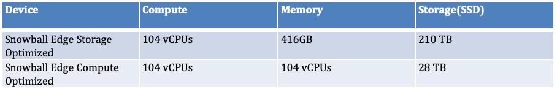
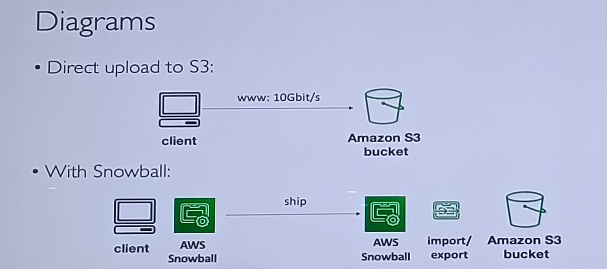
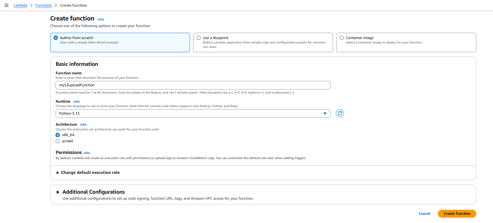
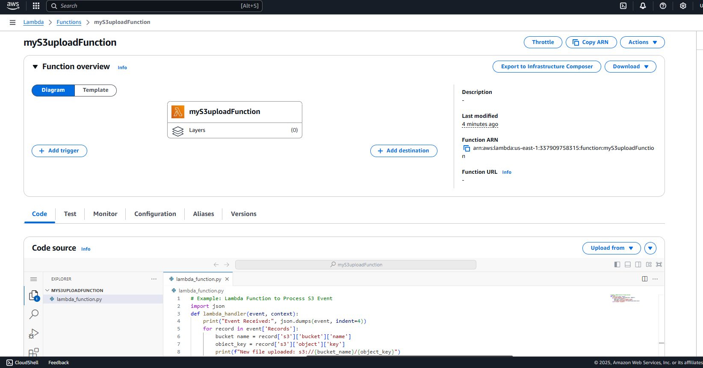
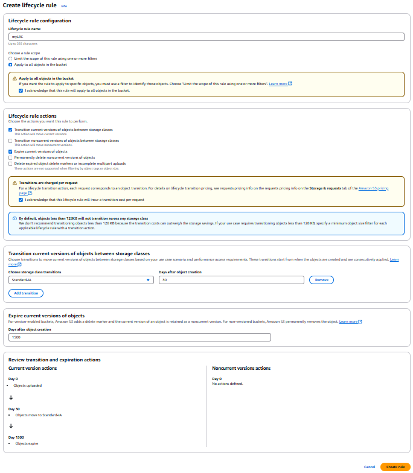
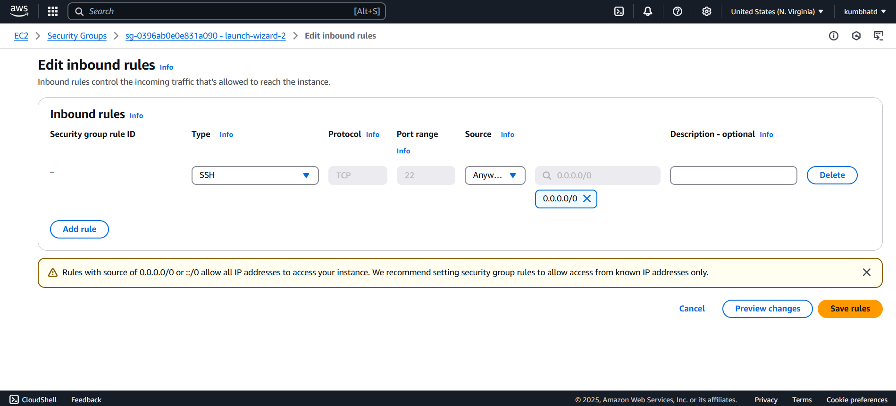
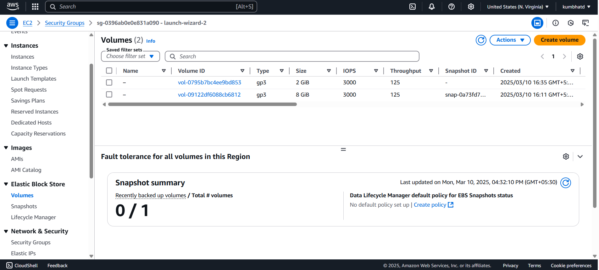

### AWS Snowball

AWS Snowball is a **data transfer and edge computing service** designed to move large amounts of data securely between on-premises locations and AWS. It is part of the **AWS Snow Family** and is used for data migration, edge processing, and analytics in remote environments.  


#### **Key Features:**  
1. **Data Transfer** – Helps transfer petabytes of data quickly without relying on the internet.  
2. **Edge Computing** – Supports local processing using AWS IoT Greengrass and EC2 instances.  
3. **Security** – Uses **256-bit encryption** and **tamper-proof hardware** for secure data handling.  
4. **Variants** – Comes in two versions:  
   - **AWS Snowball Edge Storage Optimized** (for large-scale data migration).  
   - **AWS Snowball Edge Compute Optimized** (for high-performance computing at the edge).  
5. **Use Cases** – Cloud migration, disaster recovery, media content distribution, and edge analytics.  

It is ideal for organizations dealing with **huge datasets** in **remote or low-bandwidth areas** where internet-based transfer is impractical.



---
### **AWS Lambda – Short Notes**  

AWS Lambda is a **serverless computing service** that automatically runs code in response to events without requiring server management. It follows an **event-driven** model and executes code only when triggered, ensuring cost efficiency.  

AWS gives some cpu and ram and charges for the time function runs 

**max computing time limit**: 15 minutes 

#### **Key Features:**  
1. **Serverless Execution** – No need to manage infrastructure; AWS handles scaling and availability.  
2. **Event-Driven** – Runs in response to triggers from AWS services like **S3, DynamoDB, API Gateway, SNS, and SQS**.  
3. **Supports Multiple Languages** – Works with **Python, Node.js, Java, Go, C#, and Ruby**.  
4. **Scalability** – Automatically scales based on incoming requests.  
5. **Pay-as-You-Go** – Charges only for execution time and resource usage.  

#### **Use Cases:**  
- **Real-time data processing** (e.g., image/video processing, IoT applications).  
- **Automating workflows** (e.g., triggering actions on S3 file uploads).  
- **API backend** for web and mobile apps.  
- **Security automation** (e.g., monitoring AWS logs and responding to threats).  

AWS Lambda is ideal for applications requiring **quick execution, auto-scaling, and minimal infrastructure management**.

### **AWS Lambda Example with S3**  

#### **Scenario:**  
Trigger a Lambda function when a new file is uploaded to an **S3 bucket**. The function will log the file details.

#### **Steps:**  
1. Create an **S3 bucket** in AWS.  
2. Create an **AWS Lambda function** and set the trigger as **S3 (PUT event)**.  
3. Use the following Python code in Lambda to log the uploaded file details.

---

### **Steps to Set Up Lambda with S3 Trigger**
1. **Create a Lambda function** in AWS.  
2. **Write the function code** to handle S3 events.  
3. **Deploy** the function.  
4. **Open S3 Bucket → Properties → Event Notifications → Create Event Notification** and select the **Lambda function**.  
5. **Upload a file** to the S3 bucket to trigger the function.  
6. **Check logs** in **CloudWatch → Log Groups** to see the output.  


### **Lambda Function Code (Python)**
```python
import json

def lambda_handler(event, context):
    print("Event Received:", json.dumps(event, indent=4))

    for record in event['Records']:
        bucket_name = record['s3']['bucket']['name']  # Fixed syntax
        object_key = record['s3']['object']['key']  # Fixed syntax

        print(f"New file uploaded: s3://{bucket_name}/{object_key}")

    return {"status": "Success"}
```
 


### **Expected Behavior:**
- When a **new file** is uploaded to the S3 bucket, this function will **log the event**.  
- The log output can be viewed in **AWS CloudWatch Logs**.  

---

### **AWS S3 Lifecycle Rules – Explanation**  

**Lifecycle rules** in Amazon S3 help **automate the transition and deletion** of objects based on their age. These rules optimize **storage costs** by moving objects to a cheaper storage class or deleting them when no longer needed.  

---

### **Example Lifecycle Rule:**  
**Scenario:**  
- Store objects in **Standard Storage Class** for **30 days**.  
- Move objects to a **cheaper storage class (e.g., Glacier)** after **30 days**.  
- Delete objects that are **older than 5 years**.

---

### **Steps to Set Lifecycle Rule in AWS S3:**  
1. **Go to AWS S3** and select a **bucket**.  
2. **Navigate to "Management"** → Click **"Lifecycle rules"** → **Create Lifecycle Rule**.  
3. **Define the rule name** (e.g., "Move to Glacier & Delete Old Data").  
4. **Choose the scope:**  
   - Apply to **all objects** or **specific prefix/tags**.  
5. **Set Transition Rules:**  
   - Move objects to **Glacier/IA (Infrequent Access)** after **30 days**.  
6. **Set Expiration Rule:**  
   - **Delete objects** after **5 years**.  
7. **Save and Enable** the rule.  

---


### **Storage Classes Used in Lifecycle Rules:**
- **S3 Standard** (default, frequently accessed)  
- **S3 Standard-IA** (infrequent access, lower cost)  
- **S3 Glacier** (long-term storage, retrieval time required)  
- **S3 Glacier Deep Archive** (cheapest, for long-term backup)  

---

### **Benefits of S3 Lifecycle Rules:**  
✅ **Cost Optimization** – Reduces storage costs by automatically moving data.  
✅ **Automated Data Management** – No manual intervention needed.  
✅ **Retention Policies** – Ensures compliance with data retention policies.  

Lifecycle rules **help manage storage efficiently**, making them essential for **large-scale data management and cost savings**. 🚀

---

---

### **Amazon EC2 – Overview**  

**Amazon EC2 (Elastic Compute Cloud)** provides scalable virtual servers in AWS. It allows users to run applications in the cloud with complete control over computing resources.  

---

### **Launching an EC2 Instance:**
1. **Go to AWS EC2 Console** → Click **Launch Instance**.  
2. **Choose an AMI (Amazon Machine Image)** → (e.g., Ubuntu, Amazon Linux).  
3. **Select Instance Type** (CPU, RAM, Storage).  
4. **Configure Instance Details** (VPC, Auto-scaling, IAM roles).  
5. **Add Storage (EBS/EFS)**.  
6. **Configure Security Group** → Enable necessary ports.  
7. **Generate Key Pair** for SSH access.  
8. **Launch the Instance** 🚀.  

---

### **Connecting to an EC2 Instance**
- Use **SSH** to connect:  
  ```bash
  ssh -i "your-key.pem" ec2-user@your-instance-ip
  ```
- **Ensure Security Group Rules:**  
  - **Inbound Rules:** Allow SSH (Port **22**) for remote access.  
  - **Outbound Rules:** Define traffic allowed out of the instance.  


---

### **Default Ports in EC2:**
| Service  | Port |
|----------|------|
| SSH      | 22   |
| HTTP     | 80   |
| HTTPS    | 443  |
| MySQL    | 3306 |

---

### **EC2 Storage Options & Use Cases**  

Amazon EC2 offers multiple storage options, each suited for different use cases based on performance, persistence, and scalability needs.  


### **1. Elastic Block Store (EBS) – Persistent Block Storage**  
   - Block-level storage that remains even after stopping an instance.  
   - Needs to be **in the same Availability Zone as the EC2 instance**.  
   - Steps:  
     - **EC2 → Volumes → Create Volume** (set size, AZ).  
     - **Attach Volume** to an instance.  
     - **Format and Mount** the volume inside EC2. 
    

✅ **Use Case:**  
- Best for **databases** (MySQL, PostgreSQL, MongoDB).  
- Suitable for **application servers** that need durable storage.  
- Used for **big data processing** (Hadoop, Spark).  

🔹 **Example:** Attach an **EBS volume** to an EC2 instance running a MySQL database for persistent data storage.  

---

### **2. Elastic File System (EFS) – Shared File Storage**  
- Fully **managed network file system** (NFS).  
   - Can be accessed by **multiple EC2 instances across AZs**.  
   - Auto-scales based on demand.  

✅ **Use Case:**  
- Ideal for **multiple EC2 instances** needing shared access.  
- Best for **web applications** (e.g., WordPress) and **microservices**.  
- Used for **container storage** (EKS, Kubernetes, Docker).  

🔹 **Example:** A fleet of EC2 instances hosting a PHP application can share **media files** via EFS.  

---

### **3. Instance Store – Temporary Storage**  
- **Ephemeral storage** tied to the EC2 instance.  
   - **Data is lost** when the instance stops or terminates.  

✅ **Use Case:**  
- Best for **cache storage** or **temporary processing** (e.g., video rendering).  
- Suitable for **high-speed, low-latency applications** (e.g., gaming, real-time analytics).  
- Used when **data persistence is not required** after instance termination.  

🔹 **Example:** A high-performance **Apache Spark cluster** uses Instance Store for temporary shuffle data.  

---

### **Comparison Table**
| Storage Type  | Durability | Access | Performance | Best For |
|--------------|------------|--------|-------------|----------|
| **EBS** | Persistent | Single EC2 | High | Databases, app servers |
| **EFS** | Persistent | Multiple EC2s | Scalable | Web apps, shared files |
| **Instance Store** | **Temporary** | Single EC2 | Very High | Cache, real-time processing |
---


### **Key Notes:**
✅ **EC2 = Elastic Cloud Compute (Scalable Virtual Machines)**  
✅ **Security Groups** control who can access the instance.  
✅ **EBS is persistent storage, EFS is shared, and Instance Store is temporary**.  


### **Snapshots in AWS (EBS Snapshots) – Short Notes**  

**EBS Snapshots** are **point-in-time backups** of an **Amazon EBS volume**. They allow you to restore data, migrate storage, and create new volumes.  

---

### **Key Features:**  
✅ **Incremental Backups** – Only saves **changed data** after the first full snapshot.  
✅ **Stored in S3** – Secure and cost-effective storage.  
✅ **Restorable** – Can create a new **EBS volume** from a snapshot.  
✅ **Cross-Region & Cross-Account Copy** – Snapshots can be copied across AWS **Regions** or shared with other AWS accounts.  

---

### **Steps to Create an EBS Snapshot:**  
1. **Go to AWS Console** → **EC2** → **Elastic Block Store (EBS)** → **Snapshots**. 
* If something is running on instance stop instance then create snapshot 
2. Click **Create Snapshot** → Select the **EBS volume** to back up.  
3. Add a **description** → Click **Create Snapshot**.  
4. The snapshot is stored in **Amazon S3** internally.  

---

### **Use Cases:**  
🔹 **Disaster Recovery:** Restore lost data if an EC2 instance crashes.  
🔹 **Migration & Cloning:** Move an EBS volume to another region/account.  
🔹 **Backup Strategy:** Regular snapshots ensure **data durability**.