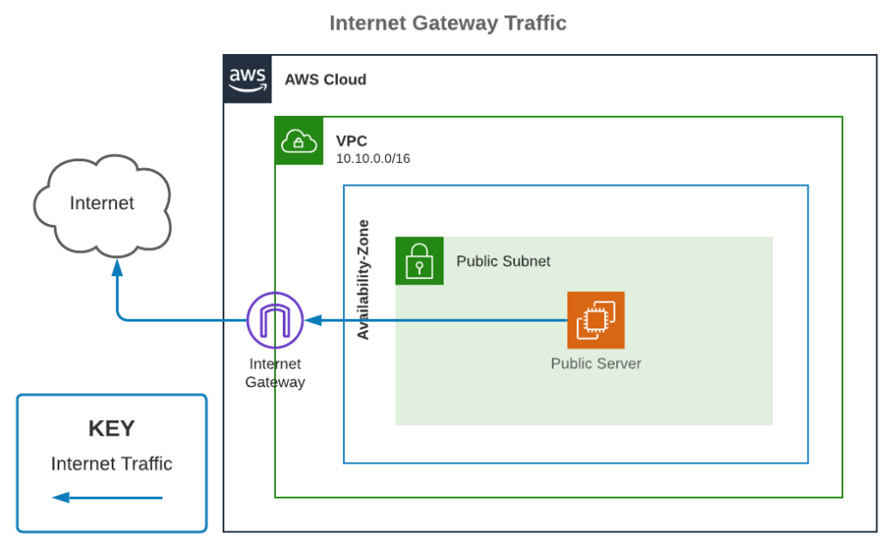
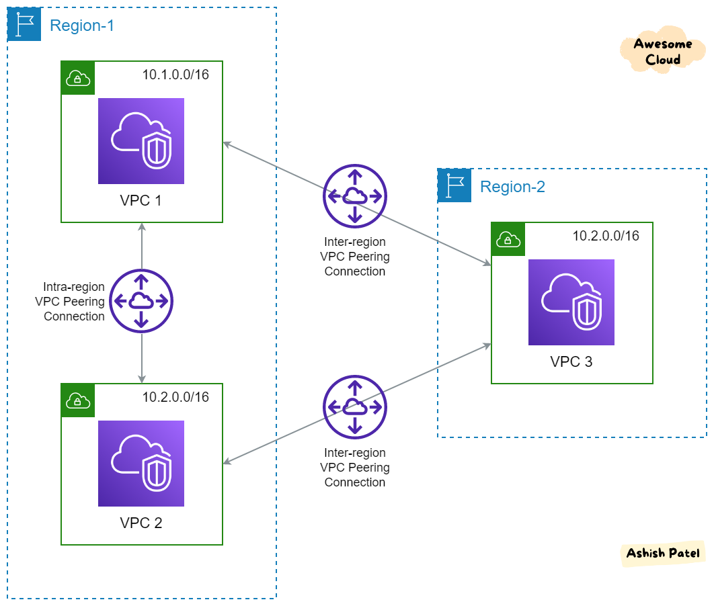
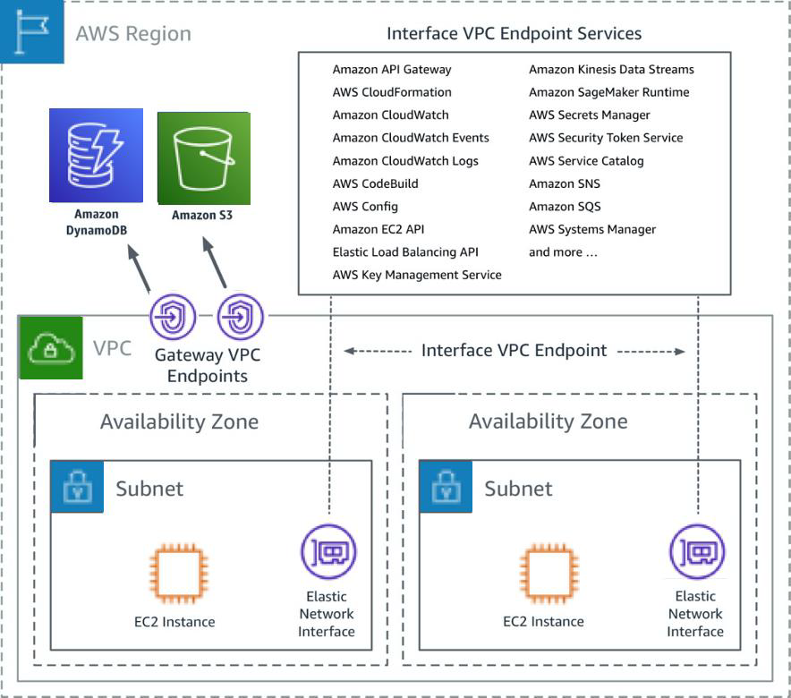

# **AWS Training - Day 8**  

### **1. Virtual Private Cloud (VPC)**
- A **VPC** is a logically isolated section of the AWS cloud where you can launch AWS resources within a virtual network. It provides complete control over the virtual networking environment, including IP address ranges, subnets, route tables, and network gateways.
- **Limitations**:
  - You can create up to **5 VPCs per AWS Region** by default (can be increased by requesting AWS support).
  - Each VPC can have up to **200 subnets**, which allow you to segment your resources within the VPC for better organization and security.

---

### **2. Internet Connectivity for Instances in a VPC**
#### a. **Internet Gateway (IGW)**
   - A **highly available gateway** that enables communication between resources in your VPC and the public internet.
   - It is **horizontally scaled**, redundant, and managed by AWS.
   - To allow instances in a subnet to access the internet:
     - Attach the IGW to your VPC.
     - Update the subnet’s route table to direct traffic to the IGW.
     - Ensure that instances have public IP addresses or Elastic IPs assigned.
    

#### b. **NAT (Network Address Translation)**
   - NAT enables private instances (those without public IPs) to connect to the internet for outgoing requests, like software updates or patches, while preventing them from being accessed directly from the internet.

   **Types of NAT Solutions**:
   - **NAT Gateway**:
     - Managed by AWS; highly scalable and resilient.
     - Ideal for production environments where availability and scalability are critical.
     - Requires no additional administrative overhead.
     - Charged hourly plus data processing costs.
   - **NAT Instance**:
     - Self-managed EC2 instance configured as a NAT.
     - Requires manual setup, maintenance, and monitoring.
     - Must be properly sized to handle traffic.
     - Considered less scalable and fault-tolerant compared to NAT Gateway.
     - Useful in testing or low-cost environments.

---

### **VPC Flow Logs**
- **Definition**: A feature that captures information about the IP traffic going to and from network interfaces in your VPC.
- **Use Cases**:
  - Diagnosing connectivity issues by identifying rejected requests.
  - Monitoring network traffic patterns for security analysis.
  - Helping with compliance and auditing requirements.
- **Key Details**:
  - Flow logs can be enabled for a **VPC**, a **subnet**, or a **specific network interface**.
  - Logs include metadata like source and destination IPs, ports, and whether the traffic was accepted or rejected.
  - Data is stored in Amazon CloudWatch Logs or S3 for analysis.

### **VPC peering**
It is a networking connection between two Virtual Private Clouds (VPCs) that allows you to route traffic privately between them using private IP addresses. These VPCs can belong to the same AWS account or different accounts and can even be in different AWS regions (referred to as inter-region VPC peering).

### Key Features of VPC Peering:
1. **Private Communication**:
   - Enables instances in one VPC to communicate directly with instances in another VPC as if they were on the same network.
   
2. **No Single Point of Failure**:
   - The connection is based on the AWS global infrastructure, which is highly available and does not rely on a single device or gateway.

3. **No Bandwidth Bottleneck**:
   - Traffic between the peered VPCs remains within AWS infrastructure, ensuring low latency and high bandwidth.

### Use Cases for VPC Peering:
- Connecting VPCs within your organization for resource sharing.
- Enabling communication between applications or workloads split across different VPCs.
- Accessing services hosted in a different account’s VPC securely.

### How VPC Peering Works:
1. **Establishing a Peering Connection**:
   - One VPC owner initiates the peering request.
   - The other VPC owner accepts the request.
   - A peering connection is established.

2. **Route Tables Update**:
   - Each VPC must update its route tables to point traffic destined for the other VPC through the peering connection.

3. **Security Groups**:
   - Security groups and Network Access Control Lists (ACLs) need to be configured to allow communication between VPCs.

### Limitations of VPC Peering:
- **Not Transitive**:
   - If VPC A is peered with VPC B, and VPC B is peered with VPC C, VPC A cannot communicate with VPC C.
   - This can be mitigated using AWS Transit Gateway for hub-and-spoke models.
   
- **No Overlapping CIDR Blocks**:
   - The IP address ranges of the two VPCs cannot overlap.

- **Manual Maintenance**:
   - Route tables and security rules need to be manually updated in both VPCs.

### **VPC Endpoints** 
Enable secure and private connectivity between your VPC and supported AWS services, without requiring an internet gateway, NAT gateway, VPN, or AWS Direct Connect. This ensures that your data remains within the AWS network, reducing exposure to the public internet.

### Types of VPC Endpoints:
1. **Interface Endpoint**:
   - **Description**: It uses a network interface (ENI) in your VPC as an entry point for traffic destined to the service.
   - **Use Cases**: 
     - Connect to AWS services like Amazon S3, DynamoDB, CloudWatch, or third-party SaaS applications.
   - **Key Features**:
     - Highly available and scalable.
     - Integrated with AWS PrivateLink, ensuring traffic stays within the AWS private network.
   - **Security**:
     - Security groups can be used to control access.

2. **Gateway Endpoint**:
   - **Description**: It creates a target in your VPC route table for routing requests to specific AWS services.
   - **Supported Services**: Currently available for Amazon S3 and DynamoDB only.
   - **Key Features**:
     - No additional costs (unlike Interface Endpoints).
     - Easy setup using route tables.

### Benefits of VPC Endpoints:
- **Improved Security**:
  - Eliminates the need for an internet connection to access AWS services.
  - Ensures traffic remains private within the AWS network.
- **Cost Efficiency**:
  - Reduces the need for NAT gateways or VPNs, saving on data transfer costs.
- **Increased Availability**:
  - Highly resilient and fault-tolerant connections, leveraging AWS infrastructure.
- **Simplified Architecture**:
  - Easier to configure and maintain compared to traditional internet-based connectivity.

### Setting Up a VPC Endpoint:
1. Identify the AWS service you want to connect to.
2. Choose between an Interface Endpoint or Gateway Endpoint, depending on the service.
3. Create the endpoint in the AWS Management Console or using AWS CLI.
4. Update your VPC's route tables (for Gateway Endpoints) or security groups (for Interface Endpoints).

### Practical Example:
- If your application needs to retrieve files from an Amazon S3 bucket frequently, you can create a **Gateway Endpoint** for S3, allowing secure and cost-effective access without exposing your VPC to the public internet.

### **AWS PrivateLink**

Site to Site VPN & Direct Connect

AWS client VPN

Transit Gateway

VPC Closing Comments

Elastic IP

---

Leveraging the AWS Global Infrastructure
- Why make a global application  ?
   multiple geographies, decreased Latency, disaster Recovery, attack protection

- Global AWS Infrastructure
- Route 53
- Route 53 polices
- aws record types
- CloudFront
- cdn

